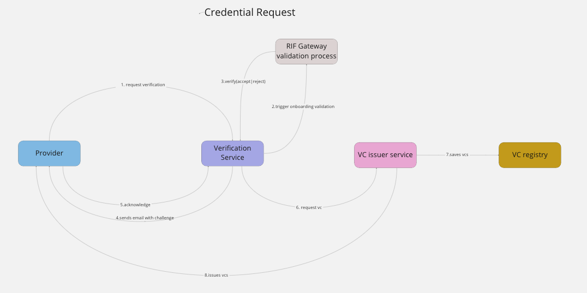

<p align="center">
  <a href="http://nestjs.com/" target="blank"></a>
</p>

[circleci-image]: https://img.shields.io/circleci/build/github/nestjs/nest/master?token=abc123def456
[circleci-url]: https://circleci.com/gh/nestjs/nest

  <h1 align="center">RIF VC Issuer service</h1>
    <p align="center">
<a href="https://www.npmjs.com/~nestjscore" target="_blank"></a>
<a href="https://www.npmjs.com/~nestjscore" target="_blank"></a>
<a href="https://www.npmjs.com/~nestjscore" target="_blank"></a>
<a href="https://circleci.com/gh/nestjs/nest" target="_blank"></a>
<a href="https://coveralls.io/github/nestjs/nest?branch=master" target="_blank"></a>
<a href="https://discord.gg/G7Qnnhy" target="_blank"></a>
<a href="https://opencollective.com/nest#backer" target="_blank"></a>
<a href="https://opencollective.com/nest#sponsor" target="_blank"></a>
  <a href="https://paypal.me/kamilmysliwiec" target="_blank"></a>
    <a href="https://opencollective.com/nest#sponsor"  target="_blank"></a>
  <a href="https://twitter.com/nestframework" target="_blank"></a>
</p>
  <!--[](https://opencollective.com/nest#backer)
  [](https://opencollective.com/nest#sponsor)-->

## Description

RIF VC Issuer service is a PoC that enables service providers to be verified within the RIF Gateway.

## Installation

```bash
$ npm install
```

## Set up

### Environment

```bash
# represents the issuer private key used when issuing vc |vp
ISSUER_PRIV_KEY=<32-bits-hex>

# represents the issuer ethereum address
ISSUER_ADDR=<20-bits-hex>

# represents the rif owner private key used for adding an the RIF Gateway signature to vc | vp
RIF_OWNER_PRIV_KEY=<32-bits-hex>

# email used for testing purposes, in practice, this wil be a real service provider email instead.
# (REMOVE IN PRODUCTION)
RIF_EMAIL_USER=<xyz@example.com>
RIF_EMAIL_PASSWORD=<string>

# RIF Gateway protocol
RIF_GATEWAY_CONTRACT=<20-bits-hex>
# address that deploys the RIF Gateway protocol contract (used when verifying a provider on-chain, via 'verifyProvider()' )
RIF_GATEWAY_DEPLOYER=<32-bits-hex>


# Fake SMTP server for email messages
# (REMOVE IN PRODUCTION)
SMTP_HOST=smtp.ethereal.email
SMTP_PORT=587
```

## Components

### listing-verification

This component exposes an API with the following operations:

- ***Provider registration***: Allows service providers to start a registration process within the RIF GATEWAY 
- ***Provider validation***: After starting the registration process, providers are validated by an external validation process (TBD)*
                             The outcome of this validation is reflected on-chain via __verifyProvider()__ contract call.
                             The outcome is also stored in this service as a proof of rejected | verified status.
- ***Provider notification***: The outcome of the previous step is notified to providers via email.
- ***Provider acknowledgment***: If the provider is accepted, then the provider needs to confirm this verification by signing an arbitrary message created by this service, just to make sure that they really want to register themselves in the RIF GATEWAY protocol.

### rif-gateway-contract

Holds the artifacts to communicate with the RIF Gateway contract.

### vc-issuer

This module acts as Verifiable Credentials Issuer. After a provider has been registered and verified successfully, a Verifiable Credential is issued, claiming that it is a verified provider within the RIF GATEWAY.

This is a mocked API service, in reality this might be an external service offered by a third party. For now, it is assumed that the RIF Gateway process has its own Verifiable Credential Issuance service.

It wraps two operations:

- ***issue credential***: Creates, signs and retrieves a credential given a payload (provider verification data)

- ***verify credential***: Takes a JWT verifiable credential and verifies it against the verifiable credential registry.


## VC Registry Contract

this project uses the DID Registry contract, for the sake of this PoC, hardhat network is used to deploy this contract that servers as a on chain resource to validate VCs and VPs. You can find the code here. [ethr-did-registry](https://github.com/uport-project/ethr-did-registry)

There are some other useful dependencies for creating, issuing and verifying vcs:

### Ethereum did standard (compatible with RSK, execpt address checksums)
[ethr-did](https://github.com/uport-project/ethr-did)
### Ethereum did registry contract
[ethr-did-registry](https://github.com/uport-project/ethr-did-registry)
### Ethereum did resolver (resolves DID documents using the DID registry)
[ethr-did-resolver](https://github.com/decentralized-identity/ethr-did-resolver)
### Provides functionality to serialize VCs in JWT standard
[did-jwt](https://github.com/decentralized-identity/did-jwt)
[did-jwt-vc](https://github.com/decentralized-identity/did-jwt-vc)

### utils

Contain crypto/hash/addresses utils

## Architecture / Flow visuals




## Functional Flow

As mentioned earlier, this part covers the phases that involves having a service provider to request validation in the RIF Gateway until the point where it is rejected/approved. It follows as this:

***Actors***

1. RIF Gateway owner
2. Service Provider candidate
3. Issuer
4. Verifiers (Wallet Providers)

***Services***

1. Listing service
2. Issuer service
3. RIF Gateway contracts
4. DID registry contract
5. VC registry

***Flow***


1. `Service Provider` request verification through `requestVerification` endpoint from `ListingService` and a verification record gets created.
2. RIF Owner reviews and verifies the request via `verify` endpoint from `ListingService`, and approves / rejects it. This approval is not yet defined, ideally this would be the onboarding process (validation process) where some checks are performed against the provider being validated.
  - If approved, an email is sent with a challenge to be signed by the `Service Provider` and go to step 3.
  - If rejected, the request is removed from storage and nothing gets validated / updated.
3. `Service Provider` signs the challenge coming from the email, and sends it through `acknowledge` endpoint from `ListingService`.
4. `ListingService` evaluates the signature of the challenge.
  - If valid, go to step 5
  - Otherwise, the service  awaits until a valid signatured is sent or the request is removed.
5. `ListingService` sends the credential payload containing the info of the service provider to `IssuerService`.
6. `IssuerService` receives the Credential Payload and issues two VCs, one for email verifaction and another one claiming the `Service Provider` is verified by the RIF Gateway
7. `IssuerService` sends back those credential to the `Service Provider` encoded as JWT.
8. `Service Provider` might optionally store those VCs in a VC registry (an IPFS node in this PoC and this step is not part of the main flow)
9. `Verifiers` takes those credentials and verify if they are legit, this verification is done using the `DID registry contract`.


### API

See the [swagger page](http://localhost:3000/api) for deep understanding on the APIs

### Database

An in memory cache is used in place of a real database, there's one single structure for the provider information being stored and it looks like this:

```ts
    const registrationData: RegistrationData = {
      did, 
      registrationId, // SHA256(did, email)
      verificationChallenge, // hex random string generated by the service itself
      verificationExpirationDate, // expiration date of this record if provider is not registered successfully
      email, 
      status, // "created" | "underReview" | "pendingConfirmation" | "verified" | "rejected"
  };
```

this object is being updated constantly in memory as the process go forward. If the registration process is not concluded successfully, the data will expire in the cache. A different mechanism should be considered when using real a database.


## Running the app

```bash
# development
$ npm run start

# watch mode
$ npm run start:dev

# production mode
$ npm run start:prod
```

## Test

```bash
# unit tests
$ npm run test

# e2e tests
$ npm run test:e2e

# test coverage
$ npm run test:cov
```

## Support

Nest is an MIT-licensed open source project. It can grow thanks to the sponsors and support by the amazing backers. If you'd like to join them, please [read more here](https://docs.nestjs.com/support).


Nest is [MIT licensed](LICENSE).
